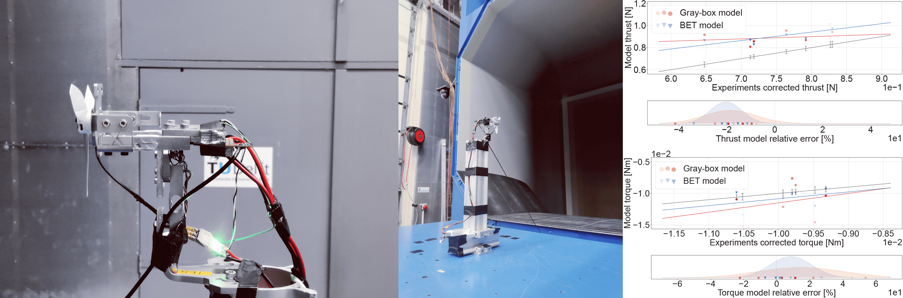

# Blade_damage_validation


This work provides the tools for the validation of the Blade Element Theory model proposed in the paper: "Blade Element
Theory Model for UAV Blade Damage Simulation". This entails the extraction, processing and visualization of wrench 
 data collected in a wind-tunnel experimental campaign.

The repository contains Python code for:
- the extraction and processing of Tyto wrench data collected at the OJF wind tunnel at TU Delft into statistical 
metrics useful for validation of the proposed BET model
- the generation of information rich plots that compare experimental and model data for validation of the proposed BET 
model

## Motivation

From fault-tolerant control to failure detection, blade damage simulation has been an
essential tool for the development and testing of failure resilient modern unmanned aerial
vehicles before their entry into service. Current approaches assume partial loss of rotor
effectiveness or reduce the problem to the centrifugal forces caused by the shift in the propeller
centre of gravity. The work in the paper titled "Blade Element Theory Model for UAV Blade Damage Simulation" 
proposes a white-box blade damage model based on Blade Element
Theory (BET) which combines the emerging mass and aerodynamic effects of blade damage. The model
serves as plug-in to the nominal system model, enables the simulation of any degree of blade
damage and does not require costly experimental data from failure cases. 

To validate the proposed BET model, it has been applied to the Parrot Bebop® 2 UAV. Its
predictions were compared to the wrench signals of a damaged propeller at multiple degrees of failure. 
The validation data was gathered during a dedicated wind tunnel experimental campaign at the Open Jet Facility at 
Delft University of Technology which allowed the controlled variation of environmental variables such as the wind speed 
(between 0 and 12 m/s) and the propeller incidence angle (between 0 and 𝜋/2 rad).

## Code structure
The project contains the following files:

PRE-PROCESSING
* *Data_pre-processing\\__init__.py*: file that calls the other data pre-processing functions and pre-processes the Tyto
measuring stand data obtained during the OJF wind tunnel campaign. It is the central file in the pre-processing stage

* *Data_pre-processing\\change_file_names.py*: based on the information stored in the file header, the file name is 
changed to reflect the wind speed, propeller incidence angle and blade damage conditions of the data collected in that
file.

* *Data_pre-processing\\separate_rpm.py*: separates each file into multiple files, each containing data about a single
propeller rotation speed. A single file is usually divided into 5 files, one for each of the following rpm values: 
300, 500, 700, 900 and 1100 rpm.

ANALYSIS AND PLOTTING
* *__init__.py*: file that calls all the functions that extract the data from the files, analysed it extracting
statistical metrics and plotting the results. It is the central file in the analysis and plotting stage.

* *user_inputs.py*: provides all the inputs that the user can modify in one centralised file.

* *data_extraction.py*: it extracts the data from the desired pre-processed file and computes some statistical metrics
such as the mean and the standard deviation. It also computes the functions that extract the correction term for the
wind forces and moments exerted on the stand (not the propeller), and the signal identification (sinusoid recontruction)
from the experimental data in the presence of blade damage. Finally, it also extracts the same metrics from signals
computed by the Blade Element Theory model and gray-box aerodynamic model in the same conditions.

* *damaged_prop_signal_id.py*: performs the signal identification (sinusoid reconstruction) from the experimental data
in the presence of blade damage. It first detrends the data, since the mean of the data should be constant in a steady
state, and then uses Particle Swarm Optimization (PSO) or the Lomb Scargle periodogram to reconstruct the signal.

* *Blade_damage*: this folder contains the Blade Element Theory and gray-box aerodynamic models that the experimental
data aim to validate. The explanation of all the files can be found in the repository of this corresponding part of the 
project.

* *compute_rpm_data_statistics.py*: computes the statistics for each rpm. This is done by compressing the information 
from all the angles with respect to the flow for a single propeller rotation velocity. The main statistics are the mean 
and standard deviation of the absolute and the relative error when comparing the experimental data obtained for each 
angle with that obtained from the models. It obtains the same statistics for the models under validation.

* *plot_statistics.py*: provides the functions to plot the processed experimental and model data.

* *helper_funcs.py*: contains the help functions required in all stages of the data extraction, statistical analysis and
 plotting.

* *compute_propeller_incidence_angle.py*: simple tool for computing the propeller incidence angles in the wind tunnel 
with the OptiTrack system.

* *Signal_id\\LombScargle_testing.py*: file that tests the accuracy of the Lomb-Scargle periodogram for signal 
reconstruction. In this case, the technique has the task of correctly discovering a sinusoid amplitude which has been 
polluted with Gaussian noise. This file also allows the creation of a plot that shows the reconstructed amplitude with 
respect to the standard deviation of the Gaussian noise polluting the original clean sinusoid.

* *Signal_id\\sinusoid_scenarios.py*: function that calls for the specific scenario to simulate for the Lomb-Scargle 
periodogram testing.


To start using the code you can download the required Python libraries stored within _requirements.txt_. For that purpose,
it is as simple as running the following command within the command line:
```shell script
pip install -r requirements.txt
```
Then adjust the parameters that you deem necessary in _user\_inputs.py_ and run __init__.py_.

You can also run it within Google Colab. For that you only copy-paste two lines. First:
```shell script
!git clone https://github.com/joigalcar3/Blade_damage_validation
```
This will clone the repository. Then you can open the _user\_inputs.py_ file and alter the user input. Second, run:
```shell script
!python Blade_damage_validation/__init__.py
```

## Implementation, results and conclusions
The results of this work can be found in the author's Master thesis and paper:

1. Master thesis: "From Data to Prediction: Vision-Based UAV Fault Detection and Diagnosis". Chapters 9.4, 
Appendices E-F.
2. Paper: "Blade Element Theory Model for UAV Blade Damage Simulation". Section VII. 

These documents explain:
* Rationale of the experimental campaign
* Test set-up, data collection and challenges
* Explanation of the data pre-processing steps
* Experimental results with and without damage, comparing the results between the Blade Element Theory and gray-box
aerodynamic models
* Validation conclusions and recommendations
* Measurement of noise impact on the Lomb-Scargle periodogram signal reconstruction

## Contact
Hope you enjoy the code!! For any questions, comments or suggestions, 
please reach out to me at [jose.dealvearcardenas@sjsu.edu](jose.dealvearcardenas@sjsu.edu). Also, please consider citing
our research work below when using this repository.
 

    @inbook{deAlvearCardenasBET2024,
        author = {José Ignacio de Alvear Cárdenas and Coen C. de Visser},
        title = {Blade Element Theory Model for UAV Blade Damage Simulation},
        booktitle = {AIAA SCITECH 2024 Forum},
        chapter = {},
        pages = {},
        doi = {10.2514/6.2024-2816},
        URL = {https://arc.aiaa.org/doi/abs/10.2514/6.2024-2816}
    }

